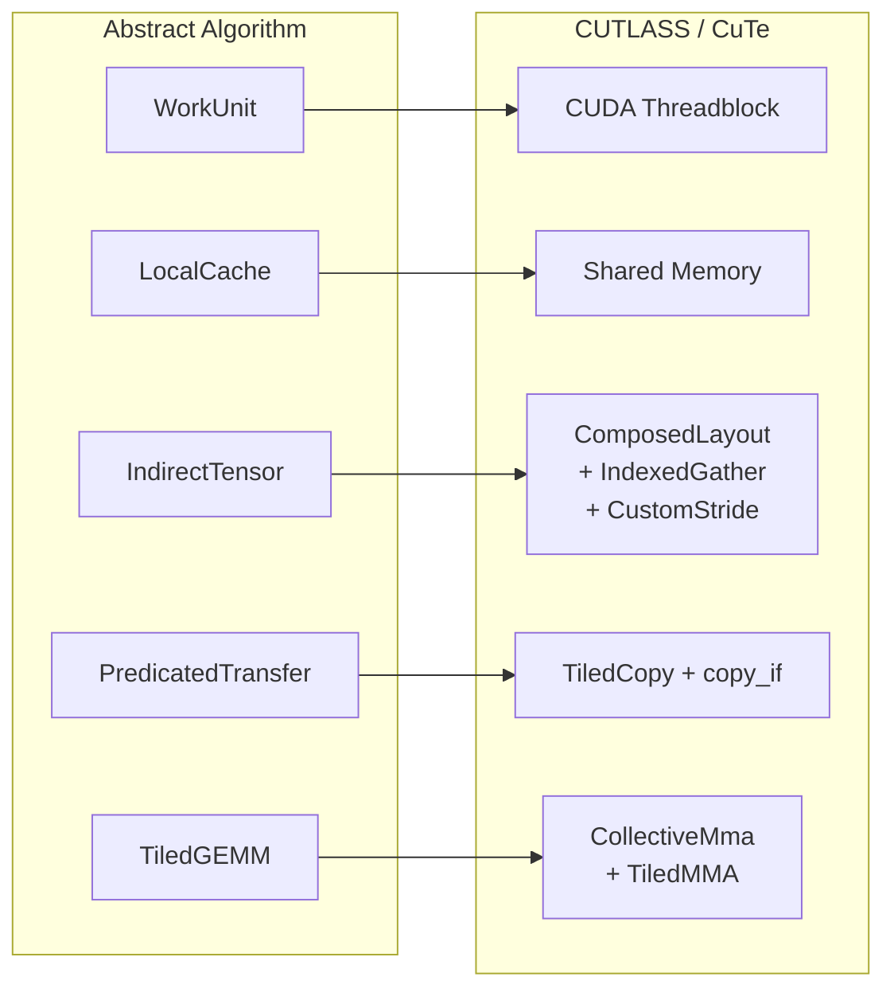

# Leaf-Level Implicit GEMM Sparse Convolution

Analysis of the sparse convolution technique from
[sifakis/openvdb `ex_sparse_convolution_igemm_nanovdb_cuda`](https://github.com/sifakis/openvdb/tree/9f636dd515890bb4f1e3161d655e5308f5a12de6/nanovdb/nanovdb/examples/ex_sparse_convolution_igemm_nanovdb_cuda),
explained independently of NanoVDB and CuTe internals.

## The Core Idea in One Sentence

Each leaf node builds a small shared-memory lookup table mapping halo voxel
positions to global feature indices, then runs the convolution as a standard
implicit GEMM (im2col-fused-into-GEMM) where every "im2col" address is
resolved at runtime through that lookup table, with predicated loads zeroing
out inactive voxels.

---

## Hardcoded Kernel Size

**The filter size is hardcoded to 3x3x3 at compile time.** In the
implementation's geometry struct, the filter dimensions T, R, S are
`static constexpr int = 3`. While the GEMM kernel is templated on a settings
struct (so a different compile-time value is syntactically possible), everything
downstream -- halo dimensions, block/cluster decomposition, shared memory
budgets, and CuTe composed layouts -- is derived from these constants. The code
only instantiates the 3x3x3 case. Changing the filter size would require a new
geometry struct with a retuned block decomposition and shared memory layout.

---

## Abstract Algorithm (NanoVDB-Free Description)

### Data Model Assumed

- A sparse set of "active" voxels, organized into **leaf nodes** of 8x8x8.
- Each active voxel has a unique linear **index** into a dense feature array:
  `features[index][C]`.
- A tree structure that, given any 3D coordinate, returns either the voxel's
  index or 0 (inactive).
- Two such grids: **input** and **output** (potentially different active sets).

### Step 1: Work Assignment -- One Threadblock per Output Leaf

```
CUDA grid: gridDim.x = number_of_output_leaf_nodes
```

Each threadblock owns one output leaf (512 output voxels) and is responsible
for computing every output feature at every active voxel in that leaf.

### Step 2: Build Index Maps in Shared Memory

This is the **only step that touches the tree structure**. Everything after it
is pure array arithmetic.

**Scatter map** (output side): For each of the 512 positions in the 8x8x8
output leaf, read the voxel's linear index from the leaf node itself. This is a
trivial local read (the leaf stores these indices directly). Result:
`scatter_idx[8][8][8]` in shared memory. A value of 0 means "inactive -- don't
write".

**Gather map** (input side): The leaf's 8x8x8 domain, expanded by the
convolution radius on each side, defines the **halo region**. For a 3x3x3
filter with radius 1, the halo is `(8+2)^3 = 10x10x10 = 1000` voxels. For
each halo position, use the tree to look up the corresponding input voxel's
index. Result: `gather_idx[10][10][10]` in shared memory. A value of 0 means
"inactive -- treat as zero input".

```
Shared memory after Step 2:
  scatter_idx[512]  -- 512 uint64 (output leaf indices)
  gather_idx[1000]  -- 1000 uint64 (input halo indices)
```

**Key insight**: This lookup is done **once** for the entire leaf. All
subsequent sub-problems within the leaf reuse these cached maps. The halo is
shared across all sub-blocks because adjacent output voxels have heavily
overlapping input neighborhoods.

### Step 3: Decompose the Leaf into Output Blocks

The 8x8x8 leaf is divided into small output **blocks** of shape (Z, P, Q)
(in the implementation: (4, 2, 2) = 16 voxels). This yields 2 x 4 x 4 = 32
blocks per leaf.

Blocks are further grouped into **clusters** of spatially adjacent blocks. The
implementation groups 1 x 2 x 2 = 4 blocks into each cluster, giving
2 x 2 x 2 = 8 clusters per leaf, each covering a 4 x 4 x 4 = 64-voxel
sub-cube of the output.

Each cluster has its own **smaller halo**: for a 4x4x4 cluster with a 3x3x3
filter, the cluster halo is 6x6x6 = 216 voxels. The predicate masks (step 5)
are built at cluster granularity.

### Step 4: Express Each Block's Convolution as GEMM (Implicit GEMM / Virtual im2col)

For one output block of |B| voxels (e.g. 16), the convolution is:

```
out[v, k] = SUM over {c, t, r, s} of
              filter[k, c, t, r, s] * in[neighbor(v, t, r, s), c]
```

where v ranges over the block's spatial positions, k over output channels,
c over input channels, and (t, r, s) over the 3x3x3 filter positions.

This is exactly a matrix multiply:

```
A = filter, reshaped as  [K_tile,  C * |filter|]    (e.g. [32, 64*27] = [32, 1728])
B = gathered input, as   [C * |filter|,  |B|]       (e.g. [1728, 16])
C = output, as           [K_tile,  |B|]              (e.g. [32, 16])
```

**The B matrix is never materialized.** Instead, the address computation is
fused into the GEMM loads (the "implicit" in implicit GEMM):

1. Given a logical GEMM coordinate (contraction_idx, spatial_idx), decode into
   (channel c, filter offset t,r,s) and (block origin + voxel z,p,q).
2. Compute the halo position:
   `halo_pos = (block_origin + (z,p,q)) * S + (t,r,s) * D`.
3. Look up the global index from shared memory:
   `global_idx = gather_idx[halo_pos]`.
4. Compute the final address: `features + global_idx * C_in + c`.

The implementation encodes this entire pipeline in CuTe's "composed layout"
system, so the GEMM kernel sees a standard-looking tensor with a custom stride
that happens to perform an indirect lookup.

### Step 5: Predicated Loads for Sparsity

Not every halo voxel has a corresponding active input voxel. When
`gather_idx[pos] == 0`, that input position is inactive. Rather than building
an explicit sparse structure, the implementation uses **predicated loads**:

- Before each cluster's GEMM, build boolean **predicate masks** in shared
  memory from the gather/scatter indices.
- During the GEMM, the B-matrix global memory loads use `copy_if` gated by the
  predicate. If the predicate is false (inactive voxel), the load is replaced
  with zero. This is a CUTLASS pipeline modification.
- Similarly, output writes use `copy_if` to skip stores for inactive output
  voxels.

This keeps the GEMM execution **regular** (no branch divergence, no
variable-length work), with sparsity handled purely by zeroing.

### Step 6: CUTLASS Ampere Pipeline

The actual GEMM uses CUTLASS's multi-stage async pipeline (adapted for the
predicated loads):

- **Filter (A)**: Loaded with standard unpredicated `cp.async` from global to
  shared memory.
- **Gathered input (B)**: Loaded with predicated `copy_if` -- the only
  modification to the standard CUTLASS mainloop.
- **Output (C)**: Accumulated in registers, written to shared memory, then
  scattered to global memory with predicated stores.

The pipeline has 3 stages, with software-pipelined shared-to-register copies
and SM80 tensor core MMA operations (SM80_16x8x8_F32TF32TF32F32_TN).

### Step 7: Full Iteration Scheme per Threadblock

```
per threadblock (= per output leaf):
  1. Load gather_idx[1000] and scatter_idx[512] into shared memory  (tree lookups)
  2. for each K_tile in output_channels / tile_K:                   (channel tiling)
       for each cluster in leaf:                                    (spatial tiling)
         3. Build predicate masks for this cluster                  (from cached indices)
         4. Run pipelined GEMM:                                     (CUTLASS mainloop)
              for each C_tile in (input_channels * filter_vol):     (contraction tiling)
                - async load filter tile     -> shared memory
                - async load input tile      -> shared memory (predicated via gather map)
                - tensor core MMA accumulate
         5. Predicated scatter-write output                         (via scatter map)
```

### Why the Phases Share a Single Kernel

The topology-densification phase (building the gather/scatter maps) and the
GEMM phase are fused into one kernel launch for a structural reason: the
maps live in **fast work-unit-local storage** (GPU shared memory), which
exists only for the lifetime of the work unit (threadblock). Splitting them
into separate kernels would require:

1. A global-memory buffer of `HALO_VOL * sizeof(idx)` per output leaf to
   persist the gather map between launches.
2. A second kernel launch to re-read those maps into fast local storage
   before the GEMM can begin.
3. The associated bandwidth cost of writing and re-reading the maps through
   slow global memory.

The single-kernel design avoids all three costs. The maps are ephemeral:
built cooperatively by the work unit's threads, consumed immediately during
the GEMM, and discarded when the work unit terminates. This is also why the
algorithm collapses the 27 separate kernel launches of the per-offset
approach into one: the gather map, once built, serves all filter offsets
and all spatial sub-blocks within the leaf.

A two-kernel design is *valid* (and may be preferable if the maps need to
be cached across multiple convolution layers or training iterations), but
it trades fast-local-storage residency for a global-memory round-trip per
leaf.

---

## Formal Specification

Everything below is self-contained. It uses a pseudocode grammar defined
inline; `comptime` marks values known at compile time (or JIT time).

### Abstract Execution Model

The algorithm requires seven abstract primitives. Everything else --
pipeline depth, swizzle patterns, MMA atom shapes, thread-to-element
mappings -- is implementation tuning.

```
WorkUnit
    An independent unit of parallel work.  One WorkUnit is spawned per
    output leaf.  All threads within a WorkUnit cooperate and can
    synchronize.  (Maps to: CUDA threadblock.)

LocalCache
    Fast, WorkUnit-private storage that persists across all phases
    within the same WorkUnit invocation.  Capacity is limited
    (constraint C3).  The gather map and scatter map reside here.
    (Maps to: GPU shared memory.)

IndirectTensor(base_ptr, lookup_table, address_map)
    A tensor whose element access goes through a lookup table stored
    in LocalCache:

        IndirectTensor[coord] =
            let (table_idx, offset) = address_map(coord)
            let global_idx          = lookup_table[table_idx]
            in  base_ptr[global_idx * stride + offset]

    This is the virtual im2col.  The GEMM treats it as an ordinary
    tensor -- it never needs to know that the "stride" is actually an
    indirection through a shared-memory table.  The address_map is the
    im2col coordinate decoding (comptime-known), and the lookup_table
    is the gather_map built in Phase 1.
    (Maps to: CuTe ComposedLayout with IndexedGather + CustomStride.)

PredicatedTransfer(src, dst, mask)
    A data-movement operation that copies src to dst where mask is
    true, and writes zero where mask is false.  Used for:
      - Gather-side loads: zero-fills inactive input voxels.
      - Scatter-side stores: skips writes for inactive output voxels.
    (Maps to: CuTe copy_if with a boolean predicate tensor in
    LocalCache.)

TiledGEMM(A, B, C, tile_shape)
    A matrix multiply-accumulate C += A @ B, executed cooperatively
    by all threads in the WorkUnit, tiled along M, N, and K
    dimensions.  Either operand may be a direct tensor or an
    IndirectTensor; the PredicatedTransfer annotation on each
    operand's loads specifies which ones are predicated.  The
    contraction dimension, operand layout (NN, NT, TN, TT), and
    tile shape are all compile-time parameters.
    (Maps to: CUTLASS CollectiveMma with TiledMMA dispatching to
    hardware tensor-core instructions.)

AtomicAccumulate(partial, global_target)
    Atomically adds a WorkUnit-local partial result into a global
    accumulator.  Required when multiple WorkUnits contribute to the
    same output element (e.g. weight gradients, where every output
    leaf produces a partial grad_W that must be summed).
    (Maps to: global atomicAdd, or a separate reduction kernel
    over per-WorkUnit partial buffers.)

Epilogue(accum, dst, mask, convert)
    Writes the accumulator to the output array, with three
    responsibilities:
      1. Type conversion:  Elem_Acc -> Elem_Out  (e.g. f32 -> f16).
         Identity when Elem_Acc == Elem_Out.
      2. Predication:  skip writes where mask is false (inactive
         output voxels).
      3. Address indirection:  scatter via the scatter_map stored
         in LocalCache.
    Optionally fuses pointwise operations (bias addition, activation
    function) between conversion and store, at no extra memory cost.
    (Maps to: CUTLASS epilogue with predicated scatter and optional
    element-wise fusion.)
```

These seven primitives plus the compile-time parameters and the
SparseGrid interface (below) are the **complete abstract algorithm**.
An implementation is free to realise them however it likes -- via
CUTLASS/CuTe type algebra, via handwritten kernels, or via a JIT
code generator -- as long as the semantics are preserved.

### Notation

```
type int3   = (int, int, int)            -- 3-component integer vector
type idx    = Elem_Idx                  -- voxel feature-index (0 = inactive)
                                        --   u32 when total_voxels < 2^32; u64 otherwise
type dtype  = f32 | tf32 | f16 | bf16 | f8e4m3 | f8e5m2 | s8 | ...
                                        -- element type tag (see C6 for valid triples)

-- Element-wise vector arithmetic
(a,b,c) + (d,e,f)  = (a+d, b+e, c+f)
(a,b,c) * (d,e,f)  = (a*d, b*e, c*f)
(a,b,c) / (d,e,f)  = (a/d, b/e, c/f)   -- integer division, exact
prod(a,b,c)         = a * b * c

-- Linearisation / de-linearisation (row-major)
encode3((x,y,z), (X,Y,Z)) = x*Y*Z + y*Z + z
decode3(i,        (X,Y,Z)) = (i/(Y*Z), (i/Z)%Y, i%Z)
```

### Compile-Time Parameters

```
-- Spatial parameters
comptime LEAF  : int  = 8               -- leaf side length (hardcoded)
comptime K     : int3                   -- kernel extent per axis (e.g. (3,3,3))
comptime S     : int3                   -- convolution stride per axis (e.g. (1,1,1))
comptime D     : int3                   -- dilation per axis (e.g. (1,1,1))
comptime C_in  : int                    -- input  feature width
comptime C_out : int                    -- output feature width
comptime B     : int3                   -- output-block extent within a leaf
                                        --   (e.g. (4,2,2) -> 16 voxels per block)

-- Scalar type parameters
comptime Elem_Wt   : dtype              -- weight element type
                                        --   (e.g. f32, tf32, f16, bf16, f8e4m3)
comptime Elem_Feat : dtype              -- feature / activation element type
comptime Elem_Acc  : dtype              -- GEMM accumulator type (typically f32)
comptime Elem_Out  : dtype              -- output storage type
                                        --   (may differ from Elem_Acc; see C7)
comptime Elem_Idx  : dtype              -- index type for gather/scatter maps
                                        --   u32 if total active voxels < 2^32;
                                        --   u64 otherwise
```

All three spatial parameter vectors (K, S, D) may be **non-uniform** per axis
(e.g. K=(3,5,1), S=(1,2,2)). Non-uniformity simply makes the halo a
rectangular prism instead of a cube; the GEMM machinery is oblivious to the
asymmetry because the non-uniform bounds are absorbed into the compile-time
index arithmetic.

The algorithm's structure is identical for all scalar type choices. Types
affect only the constraint bounds (C3, C4, C5), the TiledGEMM's available
MMA atoms (C6), and whether the Epilogue must perform a type conversion
(C7).

### Derived Quantities

```
comptime OFFSET   : int3 = -((K - 1) * D) / 2     -- kernel center offset
                                                    --   (exact when K is odd)

comptime HALO     : int3 = (LEAF - 1) * S          -- halo extent in input-space
                         + (K - 1) * D
                         + (1, 1, 1)
comptime HALO_VOL : int  = prod(HALO)

comptime NBLK     : int3 = (LEAF,LEAF,LEAF) / B   -- blocks per leaf per axis
comptime NBLK_TOT : int  = prod(NBLK)             -- total blocks per leaf
comptime BLK_VOL  : int  = prod(B)                -- voxels per output block

comptime KERN_VOL : int  = prod(K)                -- filter taps (e.g. 27)
comptime CONTRACT : int  = C_in * KERN_VOL        -- full GEMM contraction length
```

### Constraints

```
C1.  LEAF % B[d] == 0,  for each d.
       Blocks tile the leaf exactly with no remainder.

C2.  HALO[d] <= 2 * LEAF + 1,  for each d.
       (The Reachability Limit.)
       A window of length W in input-space touches at most
       floor((W + LEAF - 2) / LEAF) + 1  input leaves.  For the
       algorithm to stay within a 3x3x3 leaf neighborhood, this
       count must be <= 3, which requires HALO[d] <= 2*LEAF + 1.
       Expanded:
         (LEAF - 1) * S[d]  +  (K[d] - 1) * D[d]  <=  2 * LEAF
       For LEAF=8 the right-hand side is 16.  Example limits:
         S=1  D=1  =>  K <= 10
         S=2  D=1  =>  K <= 3
         S=1  D=2  =>  K <= 5

C3.  LocalCache capacity (type-aware scratchpad limit):

       index_maps   = HALO_VOL * sizeof(Elem_Idx)              -- gather map
                    + LEAF^3   * sizeof(Elem_Idx)               -- scatter map

       gemm_buffers = TILE_M  * TILE_CK * sizeof(Elem_Wt)   * PIPE  -- A-tile pipeline
                    + BLK_VOL * TILE_CK * sizeof(Elem_Feat)  * PIPE  -- B-tile pipeline

       predicates   = CL_HALO_VOL * sizeof(bool)               -- cluster gather mask
                    + CL_VOL      * sizeof(bool)                -- cluster scatter mask

       index_maps + max(gemm_buffers, epilogue_smem) + predicates
           <= GPU_SHARED_MEMORY_LIMIT

       (The mainloop GEMM buffers and the epilogue staging buffer
       share the same memory via a union, so only the larger counts.)

       Halving the element size (e.g. f32 -> f16) roughly doubles the
       GEMM tile that fits, directly improving arithmetic intensity.
       Shrinking Elem_Idx from u64 to u32 saves ~6 KB for a typical
       3x3x3 kernel (1512 entries * 4 bytes saved).

C4.  C_in  % GEMM_TILE_CK == 0
C5.  C_out % GEMM_TILE_M  == 0
       Channel dimensions are multiples of the GEMM tile sizes so that
       no predication / edge handling is needed along those axes.
       The required alignment depends on the scalar types: FP32 MMA
       atoms typically require multiples of 4; FP16/BF16 require
       multiples of 8; FP8 may require multiples of 16 or 32.

C6.  (Elem_Wt, Elem_Feat, Elem_Acc) must form a valid MMA triple.
       The hardware provides matrix multiply-accumulate instructions
       for specific type combinations only.  Common valid triples:

         Elem_Wt    Elem_Feat   Elem_Acc   Hardware    MMA shape
         -------    ---------   --------   --------    ---------
         f32/tf32   f32/tf32    f32        SM80+       16x8x8
         f16        f16         f16/f32    SM80+       16x8x16
         bf16       bf16        f32        SM80+       16x8x16
         f8e4m3     f8e4m3      f32        SM89+       16x8x32
         f8e4m3     f8e5m2      f32        SM89+       16x8x32
         s8         s8          s32        SM80+       16x8x32

       The algorithm does not depend on which triple is chosen.
       The triple determines the MMA atom shape available to the
       TiledGEMM, which in turn determines the minimum tile sizes
       and the alignment requirements for C_in and C_out (C4, C5).

C7.  Elem_Out must be assignable from Elem_Acc.
       If Elem_Out != Elem_Acc (the mixed-precision case), the
       Epilogue must include a type-narrowing conversion (e.g.
       f32 -> f16 with rounding).  This conversion is fused into
       the scatter-write and adds no extra memory traffic.
```

### Sparse Grid Interface

The algorithm requires exactly three operations from the sparse grid. No
other structural knowledge (tree depth, node fan-out, etc.) leaks past this
interface.

```
trait SparseGrid:
    leaf_count()           -> int      -- number of leaf nodes
    leaf_origin(leaf_id)   -> int3     -- world-coordinate origin of a leaf
    leaf_value(leaf_id, p) -> idx      -- leaf-local position p in [0,8)^3
                                       --   -> feature index (0 = inactive)
    coord_to_idx(coord)    -> idx      -- arbitrary world coordinate
                                       --   -> feature index (0 = inactive)
                                       -- This is the expensive tree traversal.
```

### The im2col Map

The heart of the implicit GEMM. This function maps a logical GEMM coordinate
to a physical feature-memory address, without materialising the unrolled
activation matrix.

```
-- Inputs that are fixed for the duration of one block's GEMM:
--   block_orig : int3   -- leaf-local origin of the current output block
--   gather_map : idx[HALO[0]][HALO[1]][HALO[2]]   -- in shared memory

function im2col(
    ck         : int,       -- contraction index in [0, CONTRACT)
    n          : int,       -- spatial index     in [0, BLK_VOL)
    block_orig : int3,
    gather_map : idx[HALO],
    comptime flip : bool = false
                            -- false for forward / weight_grad;
                            -- true  for input_grad / transposed_conv
) -> (idx, int):            -- returns (voxel_index, channel)

    -- 1. Decode contraction index into channel + filter offset
    c     : int  = ck / KERN_VOL                 -- channel in [0, C_in)
    delta : int3 = decode3(ck % KERN_VOL, K)     -- filter tap in [0,K)^3

    -- 1b. Flip the kernel offset for backward-direction operations.
    --     The input gradient traverses the kernel in reverse:
    --     instead of delta, it uses (K-1) - delta.  Because K is
    --     comptime-known, the compiler folds this into the static
    --     offset table.
    delta_eff : int3 = if flip then (K - (1,1,1)) - delta
                                else delta

    -- 2. Decode spatial index into position within block
    v     : int3 = decode3(n, B)                 -- in [0, B)^3

    -- 3. Compute halo-relative input position
    --    World input coord = (leaf_origin + block_orig + v) * S + OFFSET + delta_eff * D
    --    Halo origin       = leaf_origin * S + OFFSET
    --    Therefore halo-relative position:
    h     : int3 = (block_orig + v) * S + delta_eff * D   -- in [0, HALO)^3

    -- 4. Look up the global feature index
    voxel_idx : idx = gather_map[h.x][h.y][h.z]

    return (voxel_idx, c)
    -- Caller uses:  if voxel_idx != 0 then features[voxel_idx * C_in + c]
    --               else 0.0
```

**Reuse structure.** For a fixed spatial position `n`, varying the filter
offset `delta` slides through a contiguous sub-cube of `gather_map`. For a
fixed `delta`, varying `n` walks through `BLK_VOL` positions at stride `S`
in the gather map. And for a fixed `(n, delta)`, varying `c` accesses
consecutive floats at `features[voxel_idx * C_in + c]`. All three axes of
reuse come from the same shared-memory gather map.

### Kernel Pseudocode

Written using the abstract primitives from the execution model above.
Implementation-specific details (pipeline depth, thread mapping, memory
hierarchy staging) are deliberately omitted; they belong to the
TiledGEMM implementation, not to the algorithm.

```
-- One WorkUnit per output leaf.
-- Total WorkUnits = output_grid.leaf_count()

work_unit leaf_igemm_conv(
    input_grid  : SparseGrid,
    output_grid : SparseGrid,
    features    : Elem_Feat[*, C_in],
    weights     : Elem_Wt[C_out, KERN_VOL, C_in],
    output      : Elem_Out[*, C_out]
):

    leaf_id = work_unit_id()

    -- ┌──────────────────────────────────────────────────────────────┐
    -- │ PHASE 1: Topology densification                              │
    -- │ Build the lookup tables in LocalCache.                       │
    -- │ This is the ONLY phase that touches the SparseGrid.          │
    -- └──────────────────────────────────────────────────────────────┘

    cache = LocalCache()
    cache.scatter_map : idx[LEAF][LEAF][LEAF]
    cache.gather_map  : idx[HALO[0]][HALO[1]][HALO[2]]

    origin = output_grid.leaf_origin(leaf_id)

    cooperative for p in [0, LEAF^3):
        p3 = decode3(p, (LEAF,LEAF,LEAF))
        cache.scatter_map[p3] = output_grid.leaf_value(leaf_id, p3)

    halo_origin = origin * S + OFFSET
    cooperative for h in [0, HALO_VOL):
        h3 = decode3(h, HALO)
        cache.gather_map[h3] = input_grid.coord_to_idx(halo_origin + h3)

    synchronize(cache)

    -- ┌──────────────────────────────────────────────────────────────┐
    -- │ PHASE 2: Construct indirect tensors                          │
    -- │ From this point on, the SparseGrid is never touched again.   │
    -- │ The algorithm operates on tensors only.                      │
    -- └──────────────────────────────────────────────────────────────┘

    -- B matrix: virtual im2col, addressed through gather_map.
    --   Logical shape: [CONTRACT, BLK_VOL]
    --   Access pattern: B[ck, n] resolves via im2col() to
    --     features[ gather_map[h] * C_in + c ]
    --   where (h, c) = im2col(ck, n, block_orig, ...)

    B_indirect = IndirectTensor(
        base       = features,
        lookup     = cache.gather_map,
        address_map = im2col          -- the comptime-known coordinate map
    )

    -- Gather-side mask: voxel is active when gather_map entry != 0.
    gather_mask(ck, n, block_orig) =
        let h = im2col_halo_pos(ck, n, block_orig)
        in  cache.gather_map[h] != 0

    -- Scatter-side mask: voxel is active when scatter_map entry != 0.
    scatter_mask(n, block_orig) =
        let v = decode3(n, B)
        in  cache.scatter_map[block_orig + v] != 0

    -- ┌──────────────────────────────────────────────────────────────┐
    -- │ PHASE 3: Tiled GEMM with predicated gather/scatter           │
    -- └──────────────────────────────────────────────────────────────┘

    for m_tile in 0 .. C_out / TILE_M:
        for block_id in 0 .. NBLK_TOT:

            block_coord = decode3(block_id, NBLK)
            block_orig  = block_coord * B

            -- A = filter weights (direct tensor, no indirection).
            A = weights[m_tile*TILE_M .. (m_tile+1)*TILE_M,  0 .. CONTRACT]

            -- B = gathered input (IndirectTensor, parameterised by block_orig).
            B = B_indirect.bind(block_orig)

            -- C += A @ B, with B-loads gated by gather_mask.
            accum = TiledGEMM(
                A        = A,
                B        = B,
                load_B   = PredicatedTransfer(mask = gather_mask, fill = 0.0),
                tile     = (TILE_M, BLK_VOL, TILE_CK)
            )

            -- Scatter-write output with type conversion, gated by scatter_mask.
            Epilogue(
                accum   = accum,                     -- Elem_Acc[TILE_M, BLK_VOL]
                dst     = output,                    -- Elem_Out[*, C_out]
                mask    = scatter_mask(*, block_orig),
                convert = Elem_Acc -> Elem_Out,      -- identity when same type
                address = |n| -> cache.scatter_map[block_orig + decode3(n, B)]
                                 * C_out + m_tile * TILE_M
            )
```

**What is algorithm vs. what is implementation.** The pseudocode above
specifies everything an implementation must do, but nothing about *how*
the cooperative work is distributed across threads. The TiledGEMM is
free to use any pipeline depth, any thread-to-element mapping, and any
memory-hierarchy staging strategy. The only constraints are that B-matrix
loads must honour the PredicatedTransfer semantics (zero-fill for
inactive voxels), and the Epilogue must honour the scatter mask and
perform type conversion when Elem_Acc != Elem_Out.

### Operation Variants (forward, gradients, transposed)

The forward pseudocode above is one of four operations that share the
same three-phase structure. All four use the same DSL primitives; they
differ only in which grid is iterated, which grid is gathered from, the
GEMM operand arrangement, and the accumulation semantics.

**Notation.** Let CONTRACT = C_in * KERN_VOL, CONTRACT' = C_out * KERN_VOL.
W^T denotes the weight tensor with C_in and C_out roles swapped (and,
for input_grad, with the kernel spatially flipped -- absorbed by the
im2col flip flag). "A @ B" means the standard matrix product; "A @ B^T"
is the NT variant (B transposed).

**Parameter table.**

| | Forward | InputGrad | WeightGrad | TransposedConv |
|---|---|---|---|---|
| **WorkUnit per** | output leaf | input leaf | output leaf | output leaf |
| **Gather from** | input grid | output grid | input grid | input grid |
| **Scatter to** | output features | grad_input | grad_weights | output features |
| **im2col flip** | false | true | false | true |
| **A matrix** | W `[C_out, CONTRACT]` | W^T `[C_in, CONTRACT']` | grad_out `[C_out, BLK_VOL]` | W^T `[C_out, CONTRACT']` |
| **B matrix** | Indirect(features) | Indirect(grad_out) | Indirect(features) | Indirect(features) |
| **GEMM** | A @ B | A @ B | A @ B^T | A @ B |
| **GEMM (M, N, K)** | (C_out, BLK_VOL, CONTRACT) | (C_in, BLK_VOL, CONTRACT') | (C_out, CONTRACT, BLK_VOL) | (C_out, BLK_VOL, CONTRACT') |
| **Accumulation** | scatter | scatter | AtomicAccumulate | scatter |

**Key structural observations:**

- Forward and WeightGrad share the **same IndirectTensor** (same
  gather_map from the input grid, same im2col with flip=false). The
  weight gradient simply replaces the A matrix with grad_out and
  contracts over spatial positions instead of channels.
- InputGrad and TransposedConv share the **same IndirectTensor**
  (gather_map from the output grid, im2col with flip=true). For
  stride=1 they are structurally identical, differing only in data
  semantics (grad_out vs. features, grad_input vs. output).
- For stride=1, **all four operations have the same HALO dimensions**.
  The halo formula is symmetric in the delta direction.

**Input gradient pseudocode** (differences from forward highlighted):

```
work_unit leaf_igemm_input_grad(
    input_grid, output_grid,
    grad_output : Elem_Feat[*, C_out],    -- upstream gradient
    weights     : Elem_Wt[C_out, KERN_VOL, C_in],
    grad_input  : Elem_Out[*, C_in]       -- result
):
    leaf_id = work_unit_id()

    -- Phase 1: iterate over INPUT leaves, gather from OUTPUT grid.
    --          (Forward iterates output leaves, gathers from input.)
    cache = LocalCache()
    origin = input_grid.leaf_origin(leaf_id)           -- CHANGED: input_grid

    cooperative for p in [0, LEAF^3):
        cache.scatter_map[decode3(p,...)] =
            input_grid.leaf_value(leaf_id, decode3(p,...))   -- CHANGED

    halo_origin = origin * S + OFFSET
    cooperative for h in [0, HALO_VOL):
        cache.gather_map[decode3(h,...)] =
            output_grid.coord_to_idx(halo_origin + decode3(h,...))  -- CHANGED
    synchronize(cache)

    -- Phase 2: IndirectTensor with FLIPPED im2col.
    B_indirect = IndirectTensor(
        base        = grad_output,                     -- CHANGED: grad_output
        lookup      = cache.gather_map,
        address_map = im2col(flip = true)              -- CHANGED: flip=true
    )

    -- Phase 3: GEMM with transposed weights.
    --   A = W viewed as [C_in, C_out * KERN_VOL]      -- CHANGED: C_in on M
    --   The kernel flip is handled by im2col(flip=true), not by
    --   rearranging the weight tensor.
    for m_tile in 0 .. C_in / TILE_M:                  -- CHANGED: C_in
        for block_id in 0 .. NBLK_TOT:
            block_orig = decode3(block_id, NBLK) * B
            A = weights_transposed[m_tile*TILE_M..(m_tile+1)*TILE_M, 0..CONTRACT']
            B = B_indirect.bind(block_orig)
            accum = TiledGEMM(A, B,
                        load_B = PredicatedTransfer(mask=gather_mask, fill=0.0),
                        tile   = (TILE_M, BLK_VOL, TILE_CK))

            Epilogue(                                        -- CHANGED: Epilogue
                accum   = accum,
                dst     = grad_input,
                mask    = scatter_mask(*, block_orig),
                convert = Elem_Acc -> Elem_Out,
                address = |n| -> cache.scatter_map[block_orig + decode3(n,B)]
                                 * C_in + m_tile * TILE_M)
```

**Weight gradient pseudocode:**

```
work_unit leaf_igemm_weight_grad(
    input_grid, output_grid,
    features    : Elem_Feat[*, C_in],
    grad_output : Elem_Feat[*, C_out],
    grad_weights: Elem_Out[C_out, KERN_VOL, C_in]    -- result (global accumulator)
):
    leaf_id = work_unit_id()

    -- Phase 1: SAME as forward -- iterate output leaves, gather from input.
    cache = LocalCache()
    origin = output_grid.leaf_origin(leaf_id)
    ...build scatter_map and gather_map exactly as in forward...
    synchronize(cache)

    -- Phase 2: SAME IndirectTensor as forward (no flip).
    B_indirect = IndirectTensor(
        base        = features,
        lookup      = cache.gather_map,
        address_map = im2col(flip = false)
    )

    -- Phase 3: DIFFERENT GEMM -- contract over spatial positions.
    --   A = grad_out read directly from the output leaf: [C_out, BLK_VOL]
    --   B = IndirectTensor(features): [CONTRACT, BLK_VOL]
    --   Result = A @ B^T : [C_out, CONTRACT]
    --   This is a single GEMM per leaf that produces the full
    --   partial weight gradient (all KERN_VOL offsets at once).

    for block_id in 0 .. NBLK_TOT:
        block_orig = decode3(block_id, NBLK) * B

        A_direct = grad_output_leaf[0..C_out, block_voxels]   -- [C_out, BLK_VOL]
        B = B_indirect.bind(block_orig)                        -- [CONTRACT, BLK_VOL]

        partial = TiledGEMM(
            A_direct, B,
            layout = NT,                   -- A @ B^T
            load_B = PredicatedTransfer(mask=gather_mask, fill=0.0),
            tile   = (C_out_tile, CONTRACT_tile, BLK_VOL))

        -- Phase 4: ATOMIC accumulation (not scatter).
        --   Every WorkUnit contributes a partial; they must be summed.
        AtomicAccumulate(partial, grad_weights)
```

**Transposed convolution pseudocode:**

```
-- Structurally identical to InputGrad.  The parameter differences:
--   source data   = features     (not grad_output)
--   target array  = output       (not grad_input)
--   data semantics: this IS a convolution, not a gradient computation.
--
-- For stride=1 the algorithm is literally InputGrad with renamed I/O.
-- For stride>1 the output grid is larger (upsampling); the halo in
-- source-space is smaller (see "Stride > 1" note below).

work_unit leaf_igemm_transposed_conv(
    input_grid, output_grid,
    features : Elem_Feat[*, C_in],
    weights  : Elem_Wt[C_out, KERN_VOL, C_in],
    output   : Elem_Out[*, C_out]
):
    -- Identical to leaf_igemm_input_grad with:
    --   grad_output  replaced by  features
    --   grad_input   replaced by  output
    --   owner grid   = output_grid  (the larger, upsampled grid)
    --   source grid  = input_grid   (the smaller grid)
    -- All phases, masks, and GEMM structure are unchanged.
    ...
```

### Stride > 1: Halo Asymmetry Between Forward and Backward

For stride=1, all four operations have the same halo dimensions:

```
HALO = (LEAF - 1) * S + (K - 1) * D + (1,1,1)      -- same for all
```

For stride > 1, the **gather direction** determines the halo size:

- **Forward direction** (Forward, WeightGrad): the source grid is at
  full resolution. The halo is large:
  `HALO_fwd[d] = (LEAF - 1) * S[d] + (K[d] - 1) * D[d] + 1`

- **Backward direction** (InputGrad, TransposedConv): the source grid
  is at 1/S resolution. The halo is smaller:
  `HALO_back[d] = ceil((LEAF - 1 + (K[d] - 1) * D[d]) / S[d]) + 1`

Both formulas satisfy the same reachability constraint (C2) and
scratchpad capacity constraint (C3). The backward halo is always <=
the forward halo, so if the forward pass satisfies the constraints,
the backward pass automatically does too.

All four operations remain within the same DSL; only the compile-time
halo arithmetic changes between the forward and backward gather
directions.

### Cluster Optimisation (optional extension)

The pseudocode above iterates one block at a time. The reference
implementation groups adjacent blocks into **clusters** to amortise predicate
construction:

```
comptime CL    : int3                   -- blocks per cluster per axis
                                        --   e.g. (1, 2, 2) -> 4 blocks / cluster
comptime NCL   : int3 = NBLK / CL      -- clusters per leaf per axis

-- Constraint: NBLK[d] % CL[d] == 0, for each d.

comptime CL_EXTENT  : int3 = CL * B               -- voxels per cluster per axis
comptime CL_HALO    : int3 = (CL_EXTENT - 1) * S + (K - 1) * D + (1,1,1)
comptime CL_HALO_VOL: int  = prod(CL_HALO)
comptime CL_VOL     : int  = prod(CL_EXTENT)
```

The iteration becomes:

```
    for m_tile in 0 .. C_out / TILE_M:
        for cluster_id in 0 .. prod(NCL):

            -- Build predicate masks ONCE for the whole cluster's halo.
            cluster_coord = decode3(cluster_id, NCL)
            cluster_orig  = cluster_coord * CL_EXTENT
            shared act_pred : bool[CL_HALO_VOL]
            parallel for h in [0, CL_HALO_VOL):
                h3 = decode3(h, CL_HALO)
                act_pred[h] = gather_map[cluster_orig * S + h3] != 0
            barrier()

            -- Then iterate over blocks within the cluster.
            for local_block in 0 .. prod(CL):
                block_within_cluster = decode3(local_block, CL)
                block_orig = cluster_orig + block_within_cluster * B
                ... run GEMM phases 3-4 using the shared act_pred ...
```

This reduces the per-block predicate work by a factor of `prod(CL)` (e.g. 4x).
The tradeoff is a larger shared-memory predicate array (`CL_HALO_VOL` bools
instead of per-block halo bools).

---

## What Makes This Different from the Per-Offset Approach

For context, the existing fVDB approach (see `ImplicitGemmConv.h`) loops over
the K_vol (27) filter offsets, launching one fused gather-GEMM-scatter per
offset. Each launch reads its own set of gathered input indices from the
precomputed topology.

The colleague's approach has several structural differences:

- **Work unit**: Per-offset launches one GEMM across all voxels for a single
  filter position. Leaf-level assigns one threadblock per output leaf and fuses
  all 27 filter positions into a single kernel.
- **im2col**: Per-offset precomputes explicit index arrays for each offset.
  Leaf-level computes indices on-the-fly from a shared-memory halo lookup
  table, via CuTe composed layouts.
- **Number of kernel launches**: Per-offset requires 27 separate GEMM launches.
  Leaf-level is a single kernel launch.
- **Sparsity handling**: Per-offset uses explicit CSR topology with compacted
  indices (only active pairs). Leaf-level uses predicated loads (zero-fill for
  inactive), keeping the GEMM tile regular.
- **Tree access**: Per-offset does tree lookups during topology precomputation
  (a separate step). Leaf-level does them once per leaf at kernel start.
- **Index reuse**: Per-offset has independent index arrays for each of the 27
  filter positions. Leaf-level builds a single halo lookup (1000 entries) that
  serves all 27 offsets and all 32 sub-blocks within the leaf.

The **key performance win** of the leaf-level approach is the amortization of
index work: one 1000-entry halo lookup (from the tree) serves all 32 output
blocks and all 27 filter offsets within a leaf, whereas the offset-at-a-time
approach computes and loads independent index arrays for each of the 27 offsets.

The **key tradeoff** is that the leaf-level approach does extra multiply-add
work for inactive voxels (they contribute zero but still consume tensor core
cycles), while the explicit-topology approach only operates on active voxel
pairs. At typical occupancies (75%+), the zero-fill overhead is small compared
to the index overhead savings.

---

## Summary of Required Abstractions

The technique needs exactly three primitives from the sparse data structure:

1. **Leaf enumeration**: Iterate over all output leaf nodes.
2. **Leaf-local index read**: For a given leaf, read the linear indices of all
   512 voxels (the scatter map).
3. **Coordinate-to-index lookup**: For arbitrary 3D coordinates in the halo of
   a leaf, look up the input voxel index (the gather map). This is the tree
   traversal.

Everything else is standard GEMM machinery. The NanoVDB tree, the hierarchical
structure, the OnIndex encoding -- all of that is consumed in steps 2-3 and
then discarded. The GEMM itself sees only a flat gather index buffer in shared
memory and a composed layout that does
`features[gather_idx[halo_position] * C_in + channel]`.

---

## Design Notes

### Why Compile-Time / JIT Parameters Are Ideal

When K, S, and D are bound at compile time (via C++ templates or a JIT
code-generation framework), the inner-loop coordinate arithmetic in the
im2col map effectively disappears. The expression

```
h = (block_orig + v) * S + delta * D
```

reduces to a flat table of static integer offsets from the `gather_map` base
pointer, because `v`, `delta`, `S`, and `D` are all known constants within
each unrolled iteration. The compiler folds the multidimensional index
calculation into fused-multiply-add instructions with hardcoded memory
offsets. No runtime bounds checks, no dynamic indexing overhead.

This also means the distinction between uniform (e.g. 3x3x3) and
non-uniform (e.g. 3x5x1) kernels vanishes at the instruction level. The
only observable effect of non-uniformity is a differently shaped halo
allocation and a different set of static offsets; the tensor-core MMA
instructions are identical.

### Alternative Sparsity Handling: Zero-Vector at Index 0

The formal spec above uses explicit predicated loads (`copy_if`): if
`gather_map[h] == 0`, write zero to the GEMM tile instead of issuing a
global load. An alternative is the **zero-vector convention**: reserve
index 0 in the feature array as a permanent zero vector. Then every
`gather_map` lookup produces a valid index, and `features[0]` naturally
yields zeros for inactive voxels, eliminating predication logic entirely.

Tradeoffs:

- **Predicated loads** (used by the reference implementation): avoids
  issuing global memory reads for inactive voxels, saving bandwidth.
  Requires a modified GEMM mainloop with `copy_if`.
- **Zero-vector at index 0**: simpler control flow, works with an
  unmodified GEMM pipeline. Wastes bandwidth on reads that return zeros.
  Still requires output-side predication to avoid writing inactive
  outputs.

At high occupancy (most halo voxels are active), the bandwidth difference
is small and the zero-vector approach may be preferable for
implementation simplicity.

### Scalar Type Flexibility

The algorithm is **type-polymorphic**: the three-phase structure, the
im2col map, the gather/scatter logic, and all four operation variants
are identical regardless of whether features are FP32, FP16, BF16, FP8,
or even INT8. Only the constraint bounds and the implementation's MMA
atom selection change.

**Mixed precision is the common case.** The most practical configuration
is `Elem_Feat = f16`, `Elem_Wt = f16`, `Elem_Acc = f32`,
`Elem_Out = f16`. Features and weights are stored and transferred in
half precision (halving bandwidth and LocalCache pressure), the GEMM
accumulates in full precision (avoiding numerical drift), and the
Epilogue narrows back to half precision on output. The algorithm is
unchanged; only the Epilogue's `convert` parameter is non-identity.

**Smaller types relax the capacity constraint (C3).** FP16 features
halve the GEMM tile's shared memory footprint compared to FP32, allowing
either larger tiles (better arithmetic intensity) or deeper pipelines
(better latency hiding). FP8 quarters it. This is often the primary
motivation for lower precision in memory-bound kernels.

**The index type (Elem_Idx) is independently tuneable.** For grids with
fewer than ~4 billion active voxels, `u32` indices save ~6 KB of
LocalCache per WorkUnit compared to `u64` (1512 entries at 4 bytes each
vs. 8). This leaves more room for GEMM buffers and is almost always the
right choice in practice.

**Alignment constraints tighten for smaller types.** FP16/BF16 MMA atoms
typically require `C_in` and `C_out` to be multiples of 8 (vs. 4 for
FP32). FP8 atoms may require multiples of 16 or 32. These requirements
flow through constraints C4 and C5, which become type-dependent. A
codegen framework should compute the alignment requirement from the
chosen MMA atom shape and assert it at dispatch time.

**What types the algorithm does NOT constrain.** The index maps in
LocalCache (`gather_map`, `scatter_map`) are always integer types
(`Elem_Idx`), independent of the feature/weight types. The predicate
masks are always boolean. These do not participate in the MMA and are
unaffected by the scalar type choice. The im2col coordinate arithmetic
is always integer. In short: types only matter inside TiledGEMM and
Epilogue; everything else is type-agnostic.

---

## CUTLASS / CuTe Concepts Glossary

The reference implementation realises the abstract algorithm using NVIDIA's
CUTLASS 3.x library and its CuTe layout algebra. This section explains each
CuTe/CUTLASS concept the implementation uses, what abstract role it fills,
and whether it is algorithmically essential or merely an implementation
strategy.



### ComposedLayout

```
ComposedLayout<OuterLayout, Offset, InnerLayout>
```

The CuTe type that implements **IndirectTensor**. A composed layout
chains two layouts with an offset:

```
ComposedLayout(coord) = OuterLayout( Offset + InnerLayout(coord) )
```

In this algorithm:

- **InnerLayout** maps a logical GEMM coordinate `(ck, n)` to a pair
  `(halo_table_index, channel_offset)` using the im2col address map.
  This is entirely comptime-known.
- **Offset** is `(0, 0)` (the arithmetic identity).
- **OuterLayout** contains a `CustomStride` with an `IndexedGather`
  functor. It maps `(table_index, channel_offset)` to
  `gather_map[table_index] * C_in + channel_offset` -- performing the
  shared-memory indirection.

The GEMM template sees a tensor with the `ComposedLayout` as its layout.
It calls the layout's `operator()` to compute offsets, completely unaware
that an indirect lookup is happening underneath. This is how the virtual
im2col is made invisible to the GEMM.

**Algorithmically essential?** No. Any mechanism that computes
`features[gather_map[h] * C_in + c]` from a GEMM coordinate suffices:
a handwritten load function, a lambda, or explicit pre-materialisation.
The composed layout is a type-system technique for reusing unmodified
CUTLASS GEMM templates.

### CustomStride and IndexedGather

```
CustomStride<Func, Stride>     -- stride object: i * this = Func(i) * Stride
IndexedGather<Index>           -- Func: operator()(i) = indices_ptr[i]
```

These are the building blocks of the outer layout in `ComposedLayout`.
`IndexedGather` wraps a pointer to the shared-memory gather map.
`CustomStride` composes it with the channel stride `C_in`, so that
`index * CustomStride = gather_map[index] * C_in`.

The net effect: CuTe's layout algebra treats the gather-map indirection
as just another stride, letting it flow through all the standard tiling,
partitioning, and vectorisation machinery without special cases.

**Algorithmically essential?** No. They are the CuTe encoding of the
IndirectTensor concept.

### TiledCopy and copy_if

```
TiledCopy = make_tiled_copy(CopyAtom, ThreadLayout, ValueLayout)
copy_if(tiled_copy, predicate_tensor, src_tensor, dst_tensor)
```

`TiledCopy` is CuTe's abstraction for cooperative data movement: it maps
thread IDs to elements, defining which thread loads which element during a
global-to-shared or shared-to-register transfer. `copy_if` is the
predicated variant: before each element load, it checks a boolean tensor.
If the predicate is false, zero is written to the destination instead of
issuing a global memory read.

In this algorithm:

- **Filter (A-matrix) loads** use unpredicated `copy` -- the filter is
  always fully present.
- **Gathered input (B-matrix) loads** use `copy_if` gated by the
  gather mask. This is the concrete implementation of
  `PredicatedTransfer` for the gather side.
- **Output (C-matrix) stores** use `copy_if` gated by the scatter mask.

**Algorithmically essential?** The *concept* of predicated transfer is
essential (the algorithm must zero-fill inactive voxels). The CuTe type
is not -- a branch, a ternary, or the zero-vector-at-index-0 convention
could replace it.

### TiledMMA

```
TiledMMA<MMA_Atom, AtomLayout, TileShape>
```

CuTe's abstraction for cooperative matrix multiply-accumulate. It takes a
hardware MMA atom (e.g. `SM80_16x8x8_F32TF32TF32F32_TN` -- one warp-level
tensor-core instruction), replicates it across threads via `AtomLayout`,
and partitions the full tile via `TileShape`. Each thread owns a private
fragment of the accumulator in registers.

In this algorithm, the `TiledMMA` is configured with 2 atoms along the
M dimension (2 warps), producing a 32x32x8 cooperative tile. This is
the concrete implementation of `TiledGEMM`.

**Algorithmically essential?** The tiled GEMM concept is essential (the
algorithm IS a GEMM). The specific MMA atom and tile shape are tuning
parameters.

### CollectiveMma (the GEMM mainloop)

```
CollectiveMma<DispatchPolicy, TileShape, ElementA, StrideA, ElementB, StrideB,
              TiledMma, GmemCopyA, SmemLayoutA, SmemCopyA, ...,
                         GmemCopyB, SmemLayoutB, SmemCopyB, ...>
```

The pipelined mainloop that orchestrates the three memory levels:

```
global memory  --[cp.async]--> shared memory --[smem copy]--> registers --[MMA]--> accumulators
```

It manages a multi-stage pipeline (3 stages in this implementation):
while one stage's data is being consumed by MMA, the next stage's data is
being asynchronously loaded from global memory. This hides memory latency.

The reference implementation uses a **custom** `CollectiveMma`
specialisation (`MainloopSm80CpAsyncUnpredicatedCustom`) that differs from
stock CUTLASS in exactly one place: the B-matrix global-to-shared copy
uses `copy_if` instead of `copy`. This single change injects the
gather-side predication.

**Algorithmically essential?** The pipeline is a performance optimisation
(it hides latency). The predication extension is the only algorithmic
change relative to a stock CUTLASS GEMM -- it is what makes the GEMM
sparse-aware.

### Swizzle

```
Swizzle<B, M, S>
```

An XOR-based permutation applied to shared-memory layout indices to
distribute accesses across memory banks, avoiding bank conflicts.
For example, `composition(Swizzle<1,2,3>{}, base_layout)` permutes the
base layout's indices so that consecutive threads access different banks.

**Algorithmically essential?** No. Purely a hardware micro-optimisation
with no effect on correctness or algorithmic structure.

### local_tile / zipped_divide

```
local_tile(tensor, tile_shape, coord)  -->  tiled_tensor(tile_interior, tile_exterior)
```

CuTe functions that partition a tensor into tiles along specified
dimensions. They produce a tensor with two groups of modes: tile-internal
(the elements within one tile) and tile-external (the iteration space over
tiles). This is the mechanism by which:

- The 8x8x8 leaf is decomposed into output blocks of shape B.
- The contraction dimension `CONTRACT` is tiled into chunks of
  `TILE_CK`.
- The output-channel dimension `C_out` is tiled into chunks of `TILE_M`.

**Algorithmically essential?** The concept of tiling is essential (the
GEMM must be decomposed into tiles that fit in fast storage). The CuTe
functions are one way to express it.

---

## Source Files Reference

All files from
[`sifakis/openvdb @ 9f636dd`](https://github.com/sifakis/openvdb/tree/9f636dd515890bb4f1e3161d655e5308f5a12de6/nanovdb/nanovdb/examples/ex_sparse_convolution_igemm_nanovdb_cuda):

- `sparse_convolution_igemm_nanovdb_cuda.cpp` -- Host-side entry point, grid
  construction, benchmark driver.
- `sparse_convolution_igemm_nanovdb_cuda_kernels.cu` -- `IGEMM_Geometry`
  struct, reference implementations, kernel launch, gather/scatter index
  precomputation.
- `ampere_conv_kernel.h` -- `AmperePredicatedFprop` operator (the main kernel
  logic), `IGEMM_Layouts` (CuTe composed layouts for virtual im2col).
- `gather_tensor.hpp` -- CuTe `IndexedGather`, `CustomStride`,
  `make_gather_tensor` helpers for composed layouts.
- `sm80_mma_multistage_custom.hpp` -- Modified CUTLASS `CollectiveMma` with
  `copy_if` for predicated B-matrix loads.
- `dispatch_policy_custom.hpp` -- Custom CUTLASS dispatch policy
  (`MainloopSm80CpAsyncUnpredicatedCustom`).
